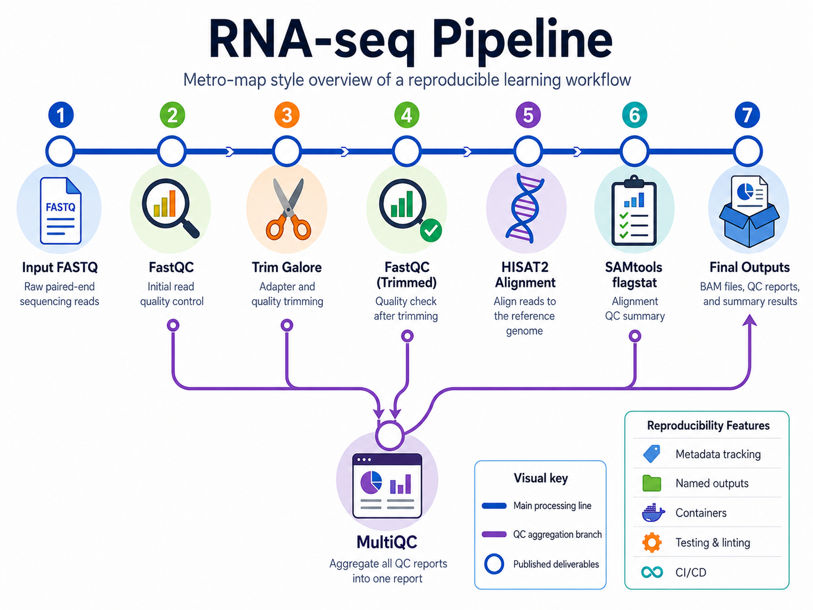
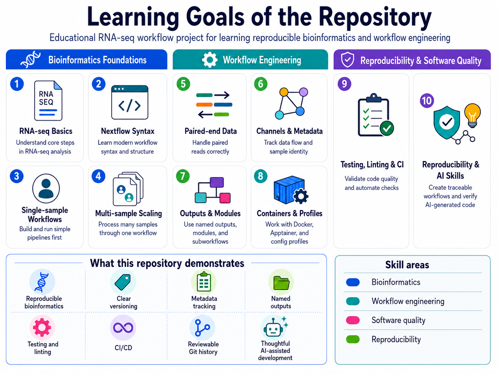
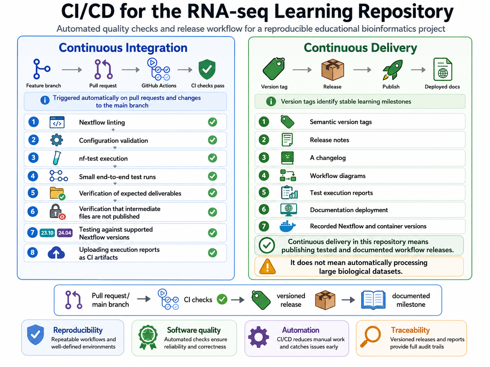
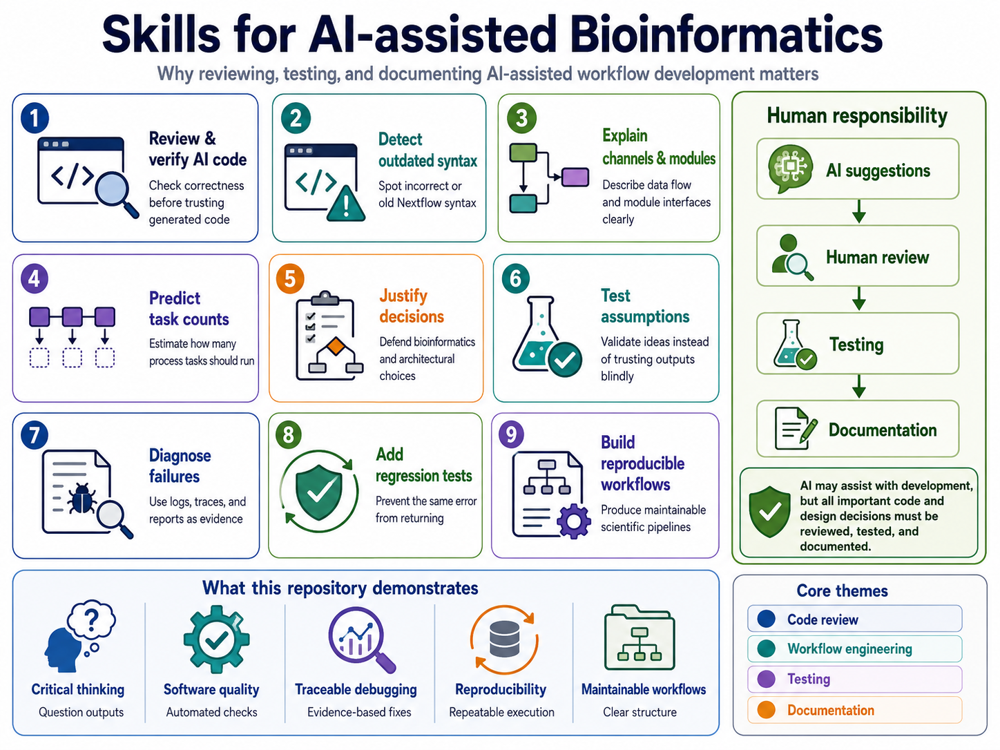
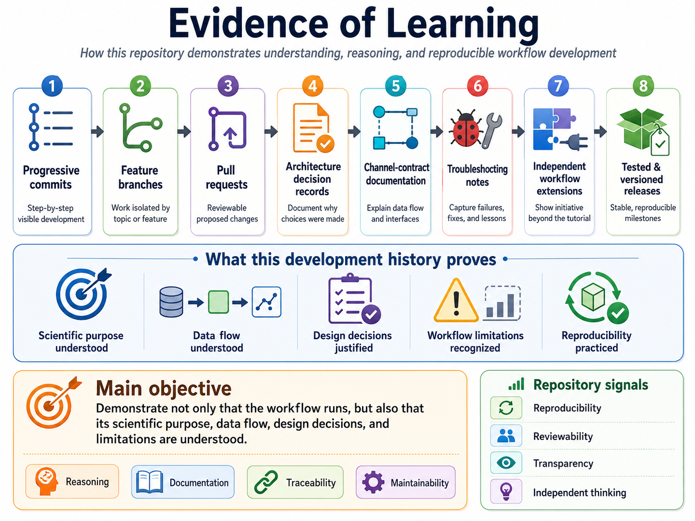

# Nextflow RNA-seq Pipeline

An educational RNA-seq workflow developed with **Nextflow** to practice reproducible bioinformatics, workflow engineering, testing, and scientific software development.

This repository is based on the **Nextflow for Science RNA-seq training course**. 

It will progressively evolve from a simple training workflow into a modular, tested, and reproducible pipeline.

## Planned workflow

The workflow will progressively include:

1. Raw-read quality control with FastQC
2. Adapter and quality trimming
3. Quality control of trimmed reads
4. Alignment to a reference genome
5. Alignment quality assessment
6. Aggregated reporting with MultiQC

Additional tools, such as SAMtools or featureCounts, may be added as independent learning extensions.



## Learning objectives

This project is being developed to strengthen practical skills in:

* RNA-seq data processing
* Modern Nextflow syntax
* Single-sample and multi-sample workflows
* Paired-end sequencing data
* Channel operations and data-flow design
* Metadata maps and sample tracking
* Named process outputs
* Workflow `publish:` sections and top-level `output {}` blocks
* Modular processes and subworkflows
* Docker and Apptainer containers
* Configuration profiles and resource management
* nf-core-inspired development practices



## Reproducibility and software quality

The repository will include:

* A pinned Nextflow version
* Versioned container images
* Documented parameters
* Metadata-preserving channels
* Small reproducible test datasets
* Named process and workflow outputs
* Traceable final deliverables
* Configuration profiles
* Execution reports, timelines, traces, and workflow diagrams
* Clear separation between intermediate files and final results
* Progressive and reviewable Git history
* Documented architectural decisions
* Troubleshooting records and regression tests

## Requirements

During the initial development stage, the workflow will require:

* Linux or macOS
* Java 17 or later
* Nextflow
* Docker

The initial development command pins **Nextflow 26.04.6**, which was the latest stable release when this README was written. Nextflow supports selecting a specific runtime version through the `NXF_VER` environment variable.

## Usage

### Run the development test workflow

The following command will be used and updated as the pipeline develops:

```bash
RUN_ID=$(date +%Y%m%d-%H%M%S)
mkdir -p "run_reports/${RUN_ID}"

NXF_VER=26.04.6 nextflow run main.nf \
    -profile test,docker \
    --input assets/samplesheet.test.csv \
    -output-dir results \
    -work-dir work \
    -resume \
    -with-trace "run_reports/${RUN_ID}/trace.txt" \
    -with-report "run_reports/${RUN_ID}/execution_report.html" \
    -with-timeline "run_reports/${RUN_ID}/execution_timeline.html" \
    -with-dag "run_reports/${RUN_ID}/workflow_dag.html"
```

The timestamped `RUN_ID` creates a separate provenance directory for every execution, preventing reports from different runs from being accidentally overwritten.

### Command explanation

| Option or parameter                   | Purpose                                                                                                      |
| ------------------------------------- | ------------------------------------------------------------------------------------------------------------ |
| `NXF_VER=26.04.6`                     | Runs the workflow with the specified Nextflow version instead of depending on an unspecified latest release. |
| `nextflow run main.nf`                | Executes the local workflow defined in `main.nf`.                                                            |
| `-profile test,docker`                | Activates the small test-data configuration and enables Docker containers.                                   |
| `--input assets/samplesheet.test.csv` | Passes the test samplesheet to the pipeline-level `input` parameter.                                         |
| `-output-dir results`                 | Sets the main directory for files published through workflow outputs.                                        |
| `-work-dir work`                      | Defines the directory used for task execution, staged inputs, cached results, and intermediate files.        |
| `-resume`                             | Reuses successfully cached tasks from a previous compatible execution.                                       |
| `-with-trace`                         | Creates a task-level table containing execution and resource information.                                    |
| `-with-report`                        | Creates an HTML execution report containing task and resource-usage summaries.                               |
| `-with-timeline`                      | Creates an HTML timeline showing when workflow tasks were executed.                                          |
| `-with-dag`                           | Creates a directed acyclic graph representing processes, operators, channels, and data dependencies.         |

Nextflow command-line options use a single dash, whereas pipeline parameters use two dashes. For example, `-resume` controls Nextflow itself, while `--input` supplies a value declared by this pipeline.

Configuration profiles can be selected with `-profile` and combined as a comma-separated list. The `-output-dir` option controls where workflow outputs are published, while the work directory stores task execution data and cached intermediate results.

The trace, execution report, timeline, and DAG provide evidence about task execution, resource usage, and workflow structure.

### Inspect the generated files

```bash
find results -maxdepth 3 -type f | sort
```

Inspect the execution history:

```bash
nextflow log
```

Lint all Nextflow files:

```bash
NXF_VER=26.04.6 nextflow lint -o concise .
```

The Nextflow linter will be used to identify syntax problems and maintain consistent modern syntax.

## Testing

The project will progressively include:

* Process-level tests
* Subworkflow tests
* End-to-end pipeline tests
* Negative tests for invalid inputs
* Output-contract checks
* nf-test snapshot testing
* Regression tests for previously identified errors

The end-to-end test will verify that:

* The expected number of samples is processed
* Expected BAM and QC files are generated
* MultiQC runs only once
* Sample metadata remains attached to the correct files
* Intermediate trimmed reads are not published unintentionally

## CI/CD



### Continuous integration

GitHub Actions will automatically run checks on pull requests and changes to the main branch.

Planned CI checks include:

* Nextflow linting
* Configuration validation
* nf-test execution
* Small end-to-end test runs
* Verification of expected deliverables
* Verification that intermediate files are not published
* Testing against supported Nextflow versions
* Uploading execution reports as CI artifacts

### Continuous delivery

Version tags will identify stable learning milestones.

Release automation may include:

* Semantic version tags
* Release notes
* A changelog
* Workflow diagrams
* Test execution reports
* Documentation deployment
* Recorded Nextflow and container versions

Continuous delivery in this repository means publishing tested and documented workflow releases. It does not mean automatically processing large biological datasets.

## Skills for AI-assisted bioinformatics

In the AI era, generating code is not sufficient. This repository aims to demonstrate the ability to:

* Review and verify AI-generated code
* Detect incorrect or outdated Nextflow syntax
* Explain channel structures and module interfaces
* Predict process task counts
* Justify bioinformatics and architectural decisions
* Test assumptions rather than trusting generated code
* Diagnose failures using execution evidence
* Add regression tests after correcting errors
* Produce maintainable and reproducible scientific workflows

AI may assist with development, but all important code and design decisions will be reviewed, tested, and documented.



## Evidence of learning

The development history will include:

* Progressive commits
* Feature branches
* Pull requests
* Architecture decision records
* Channel-contract documentation
* Troubleshooting notes
* Independent workflow extensions
* Tested and versioned releases

The objective is to demonstrate not only that the workflow runs, but also that its scientific purpose, data flow, design decisions, and limitations are understood.



## Planned repository structure

```text
.
├── main.nf
├── nextflow.config
├── conf/
├── modules/
├── subworkflows/
├── assets/
├── test_data/
├── tests/
├── docs/
├── run_reports/
└── .github/workflows/
```

Generated biological results, the Nextflow work directory, and most execution reports will not be committed to Git. Selected small reports may be retained as evidence for tagged releases.

## Current status

🚧 **Under active development**

The repository will be built incrementally while completing the Nextflow RNA-seq training course.

## License

A license will be added before the first public release.

